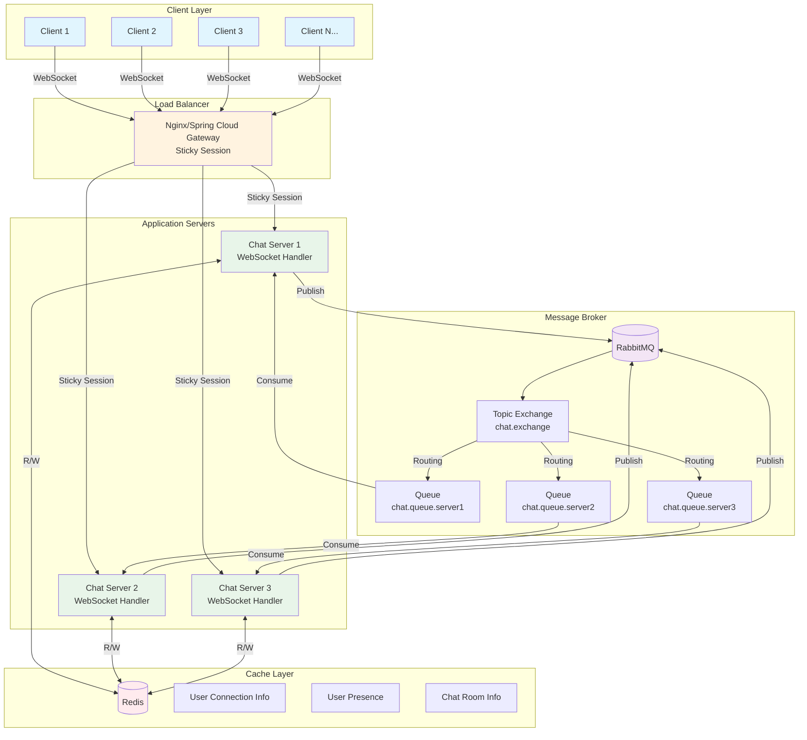
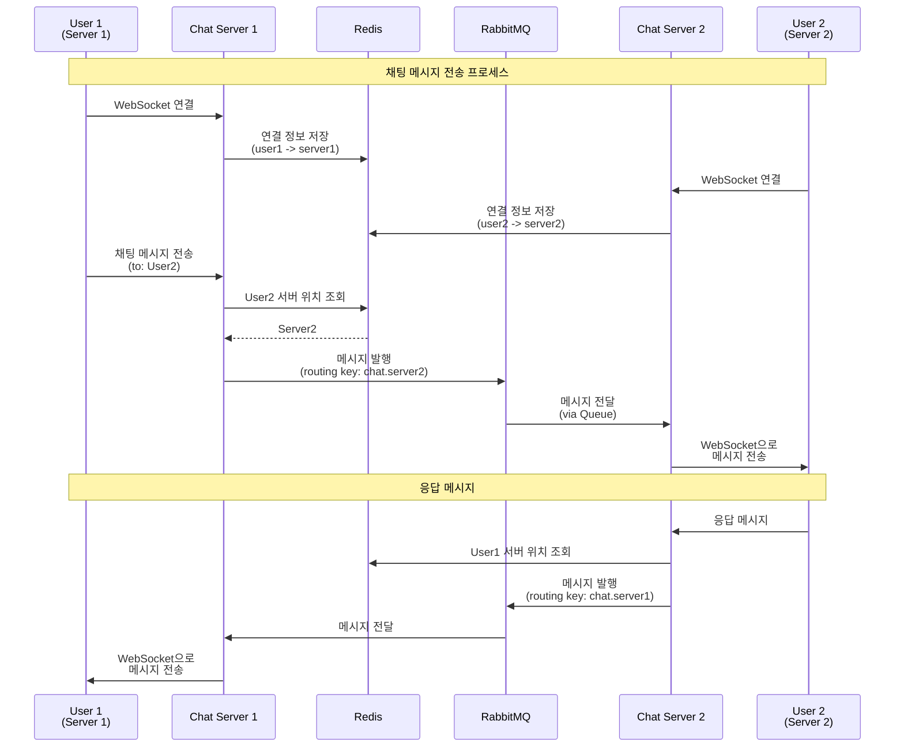

# distributed-chat-service
채팅 서비스를 대용량 처리로 연습해보기

### 아키텍쳐

### Service flow

### Stacks
- Language: Java 17
- Framework: Spring Boot, Spring WebSocket
- Message Broker: RabbitMQ
-  Cache: Redis
   Load Balancer: Nginx / Spring Cloud Gateway
- Protocol: WebSocket (with SockJS fallback)

---

### Memo
Next
- JWT 기반 인증 추가
- 파일 업로드 지원
- 읽음 확인 기능
- 타이핑 표시 기능
- 푸시 알림
- 메시지 암호화
- 데이터베이스 연동
- Kubernetes / Helm chart 배포 설정
