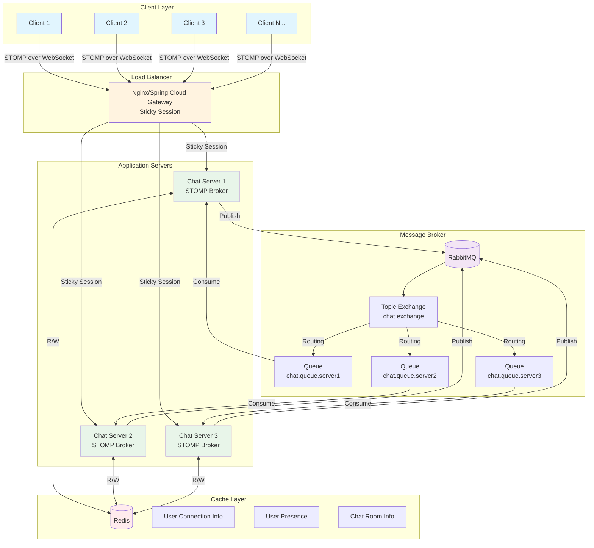
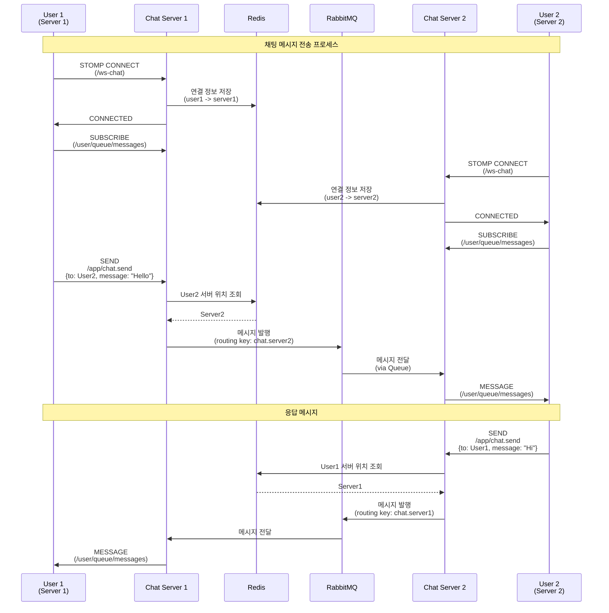

# distributed-chat-service
채팅 서비스를 대용량 처리로 연습해보기

### 아키텍쳐

```mermaid
graph TB
    subgraph "Client Layer"
        C1[Client 1]
        C2[Client 2]
        C3[Client 3]
        C4[Client N...]
    end
    
    subgraph "Load Balancer"
        LB[Nginx/Spring Cloud Gateway<br/>Sticky Session]
    end
    
    subgraph "Application Servers"
        S1[Chat Server 1<br/>STOMP Broker]
        S2[Chat Server 2<br/>STOMP Broker]
        S3[Chat Server 3<br/>STOMP Broker]
    end
    
    subgraph "Message Broker"
        RMQ[(RabbitMQ)]
        EX[Topic Exchange<br/>chat.exchange]
        Q1[Queue<br/>chat.queue.server1]
        Q2[Queue<br/>chat.queue.server2]
        Q3[Queue<br/>chat.queue.server3]
    end
    
    subgraph "Cache Layer"
        Redis[(Redis)]
        R1[User Connection Info]
        R2[User Presence]
        R3[Chat Room Info]
    end
    
    C1 & C2 -->|STOMP over WebSocket| LB
    C3 & C4 -->|STOMP over WebSocket| LB
    
    LB -->|Sticky Session| S1
    LB -->|Sticky Session| S2
    LB -->|Sticky Session| S3
    
    S1 & S2 & S3 -->|Publish| RMQ
    
    RMQ --> EX
    EX -->|Routing| Q1
    EX -->|Routing| Q2
    EX -->|Routing| Q3
    
    Q1 -->|Consume| S1
    Q2 -->|Consume| S2
    Q3 -->|Consume| S3
    
    S1 & S2 & S3 <-->|R/W| Redis
    
    style C1 fill:#e1f5fe
    style C2 fill:#e1f5fe
    style C3 fill:#e1f5fe
    style C4 fill:#e1f5fe
    style LB fill:#fff3e0
    style S1 fill:#e8f5e9
    style S2 fill:#e8f5e9
    style S3 fill:#e8f5e9
    style RMQ fill:#f3e5f5
    style Redis fill:#ffebee
```


### Service flow

```mermaid
sequenceDiagram
    participant User1 as User 1<br/>(Server 1)
    participant Server1 as Chat Server 1
    participant Redis as Redis
    participant RabbitMQ as RabbitMQ
    participant Server2 as Chat Server 2
    participant User2 as User 2<br/>(Server 2)
    
    Note over User1,User2: 채팅 메시지 전송 프로세스
    
    User1->>Server1: STOMP CONNECT<br/>(/ws-chat)
    Server1->>Redis: 연결 정보 저장<br/>(user1 -> server1)
    Server1->>User1: CONNECTED
    User1->>Server1: SUBSCRIBE<br/>(/user/queue/messages)
    
    User2->>Server2: STOMP CONNECT<br/>(/ws-chat)
    Server2->>Redis: 연결 정보 저장<br/>(user2 -> server2)
    Server2->>User2: CONNECTED
    User2->>Server2: SUBSCRIBE<br/>(/user/queue/messages)
    
    User1->>Server1: SEND<br/>/app/chat.send<br/>{to: User2, message: "Hello"}
    Server1->>Redis: User2 서버 위치 조회
    Redis-->>Server1: Server2
    
    Server1->>RabbitMQ: 메시지 발행<br/>(routing key: chat.server2)
    RabbitMQ->>Server2: 메시지 전달<br/>(via Queue)
    Server2->>User2: MESSAGE<br/>(/user/queue/messages)
    
    Note over User1,User2: 응답 메시지
    User2->>Server2: SEND<br/>/app/chat.send<br/>{to: User1, message: "Hi"}
    Server2->>Redis: User1 서버 위치 조회
    Redis-->>Server2: Server1
    Server2->>RabbitMQ: 메시지 발행<br/>(routing key: chat.server1)
    RabbitMQ->>Server1: 메시지 전달
    Server1->>User1: MESSAGE<br/>(/user/queue/messages)
```

### Stacks
- Language: Java 17
- Framework: Spring Boot, Spring WebSocket
- Message Broker: RabbitMQ
-  Cache: Redis
   Load Balancer: Nginx / Spring Cloud Gateway
- Protocol: WebSocket (STOMP), SockJS


### 📁 주요 구성 요소

#### Configuration

- WebSocketConfig: STOMP 엔드포인트 및 메시지 브로커 설정
- RabbitMQConfig: Topic Exchange와 서버별 Queue 설정
- RedisConfig: JSON 직렬화를 위한 설정


#### 핵심 서비스

- ConnectionService: Redis를 통한 사용자 연결 정보 관리
- MessageRoutingService: 메시지를 적절한 서버로 라우팅
- ChatWebSocketHandler: WebSocket 연결 및 메시지 처리
- RabbitMQListener: 다른 서버로부터 온 메시지 수신


#### Model

- ChatMessage: 메시지 타입(CHAT, JOIN, LEAVE, TYPING, READ) 지원
- UserConnection: 사용자 연결 정보
- ChatRoom: 채팅방 관리 (구현 예정)

---

### Memo
Next
- ~~JWT 기반 인증 추가~~ ✅ 완료
- ~~Rate Limiting 구현~~ ✅ 완료 (Token Bucket 알고리즘)
- 파일 업로드 지원
- 읽음 확인 기능
- 타이핑 표시 기능
- 푸시 알림
- 메시지 암호화
- 메시지 영구 저장 (DB)
- Kubernetes / Helm chart 배포 설정

---

### Issue
- ~~서버, 클라이언트 간의 프로토콜 미일치 (STOMP / WebSocket)~~ ✅ STOMP로 통일
- ~~발신자 에코백 없음~~ ✅ 발신자에게 메시지 에코백 구현
- ~~userId 중복 가능성 (인증 시스템 필요)~~

---

### 대용량 처리 최적화
With cloude :)

**대용량 처리 전략**
- 수평 확장: 서버 여러 대로 트래픽 분산 (RabbitMQ + Redis)
- 메시지 큐: RabbitMQ로 서버 간 메시지 라우팅
- 캐싱: Redis로 DB 부하 감소
- 목표: 동시 접속자 수만 명, 초당 수천 개 메시지 처리

**Rate Limiting (안전장치)**
> 목적: 비정상적인 대량 트래픽으로부터 시스템 보호  
> 정상 사용자에게는 영향 없도록 여유롭게 설정

- **제한 수치**
  - 익명 사용자: 분당 200개 (초당 ~3개)
  - 인증 사용자: 분당 500개 (초당 ~8개)
  - 버스트 허용: 10초간 최대 100개
  
- **구현 방식**
  - 알고리즘: Token Bucket (순간적 버스트 허용)
  - 저장소: Redis (메모리 효율적, TTL 5분)
  - 적용 시점: ChatController 진입점 (시스템 부하 최소화)
  
- **Redis 키 구조**
  - `rate:anon:{clientIdentifier}` - 익명 사용자 Rate Limit
  - `rate:auth:{userId}` - 인증 사용자 Rate Limit
  
- **참고**
  - 정상 사용자는 분당 10개 미만 전송 → 제한 체감 없음
  - 봇/스크립트는 초당 수백 개 시도 → 확실히 차단

### 기술 스택
- Spring Security + JWT
- 비밀번호 암호화: BCrypt
- 추가 Redis 키 구조:
  - `auth:token:{userId}` - JWT 토큰 관리
  - `auth:refresh:{userId}` - Refresh 토큰
  - `rate:anon:{clientIdentifier}` - 익명 Rate Limit
  - `rate:auth:{userId}` - 인증 Rate Limit
---

## 📚 문서

### Redis 키 구조
프로젝트에서 사용하는 모든 Redis 키 구조와 사용법은 다음 문서를 참고하세요:

👉 **[Redis Keys Documentation](./REDIS_KEYS_DOCUMENTATION.md)**

**주요 내용:**
- Rate Limiting 키 (익명/인증 사용자)
- 사용자 연결 관리 키
- 세션 관리 키
- 채팅방 관리 키
- 메시지 히스토리 키
- 사용자 상태 관리 키
- Redis 모니터링 및 최적화 가이드

**빠른 참조:**
```bash
# Redis CLI 접속
docker-compose exec redis redis-cli -a test

# 전체 키 조회
KEYS *

# Rate Limiting 키 조회
KEYS rate:*
```

---

## 🔄 WebSocket 세션 장애 복구 (Failover)
> **브랜치:** `feature/websocket-session-failover`

### 작업 배경
CDN과 GSLB를 공부하다가 문득 든 생각...

> "사용자가 서버에 연결된 상태에서, 해당 서버가 예기치 못한 상황으로 인해 다운될 경우 세션과 메세지가 유실될 가능성이 있는가?"

생각해보니,  **WebSocket 세션 등록 단계에서 실제로 유실이 발생할 수 있다** 싶음

### 현재 문제점
`SessionManager`의 현재 구조

- `localSessions` (서버 메모리) — 실제 WebSocket 세션 객체
- Redis — 사용자가 어떤 서버에 연결되어 있는지의 매핑 정보

1. Pod가 다운되면 `localSessions`는 통째로 사라지지만, Redis 연결 정보가 남아있는 상황
2. 다른 서버가 이 유저에게 메세지를 라우팅하려고 Redis를 조회하면 다운된 서버를 향해 전달을 시도하고, 전달 안됨
3. 또한 Pod가 갑작스럽게 종료되면 `afterConnectionClosed()`가 실행되지 않아서 redis 에 죽은 서버에 대한 정보가 남아있음 : TTL이 사라질때까지

example
- Server 역할을 하는 Pod 가 총 3개 떠있고, 그중 server1 의 pod 가 내려갔을 경우
  - localSession 은 사라짐
  - redis 는 정보가 남아있지만, 다운된 서버로 연결되어있음 으로 남음(...)
  - 이 상태에서 다른 서버에 있는 유저가 해당 유저로 메세지를 보낸다면, fail

### 수정 방향
1. **죽은 세션 감지** — 메세지 라우팅 시 대상 서버가 유효한지 확인하고, 다운된 서버로의 라우팅을 차단 
   - 비정상 shutdown 에 대한 대응
2. **Redis 세션 정보 정리** — 다운된 서버의 세션 정보를 신속히 무효화하여 잘못된 라우팅 방지 
    - Graceful shutdown
3. **클라이언트 재연결 유도** — 서버 다운 시 클라이언트가 다른 서버로 재연결할 수 있도록 처리


---

## DB 교체작업
SQLite -> H2 로 교체

사유: SQLite 는 기본적으로 데이터베이스 파일에 락을 걸어서 CRUD 작업을 하므로, 아무리 connection pool 을 조정해도 동시성 제어에서 제약사항이 많음

정리 (from claude)
```text
- 쓰기 작업 시 데이터베이스 전체에 배타적 락(exclusive lock)이 걸립니다
- 여러 읽기는 동시에 가능하지만, 쓰기 중에는 읽기도 차단됩니다
- WAL(Write-Ahead Logging) 모드를 사용하면 개선되긴 하지만, 여전히 한 번에 하나의 쓰기만 가능합니다
- Connection pool을 늘려도 실제로는 순차적으로 처리되기 때문에 의미가 없습니다

H2의 장점
H2는 동시성 관점에서 훨씬 유리합니다.

- 행 수준 락(row-level locking)을 지원합니다
- 여러 커넥션에서 동시에 다른 행에 대한 쓰기가 가능합니다
- MVCC(Multi-Version Concurrency Control)를 지원하여 읽기와 쓰기가 서로를 차단하지 않습니다
- 실제 프로덕션 데이터베이스(PostgreSQL, MySQL 등)와 유사한 동시성 메커니즘을 제공합니다

따라서 낙관적 락(Optimistic Lock), 비관적 락(Pessimistic Lock), 트랜잭션 격리 수준 등 데이터베이스 동시성 제어 기법을 연습하시려면 H2로 전환하시는 것이 좋습니다.
```

## StompBrokerRelay 사용

WebSockerConfig
- `enableSimpleBroker()` → `enableStompBrokerRelay()` 로 변경

변경 이유
- SimpleBroker의 인메모리 방식은 분산 환경에서 서버별로 브로커가 분리되는게 문제 -> 요청량이 많을수록 메모리 사용량이 올라감
- 모든 서버가 중앙의 RabbitMQ 브로커를 공유한다면? -> StompBrokerRelay 
- 어차피 이미 RabbitMQ 를 사용중이였으니까, STOMP 프로토콜에도 활용