# distributed-chat-service
채팅 서비스를 대용량 처리로 연습해보기

### 아키텍쳐

### Service flow

```mermaid
sequenceDiagram
    participant User1 as User 1<br/>(Server 1)
    participant Server1 as Chat Server 1
    participant Redis as Redis
    participant RabbitMQ as RabbitMQ
    participant Server2 as Chat Server 2
    participant User2 as User 2<br/>(Server 2)
    
    Note over User1,User2: 채팅 메시지 전송 프로세스
    
    User1->>Server1: STOMP CONNECT<br/>(/ws-chat)
    Server1->>Redis: 연결 정보 저장<br/>(user1 -> server1)
    Server1->>User1: CONNECTED
    User1->>Server1: SUBSCRIBE<br/>(/user/queue/messages)
    
    User2->>Server2: STOMP CONNECT<br/>(/ws-chat)
    Server2->>Redis: 연결 정보 저장<br/>(user2 -> server2)
    Server2->>User2: CONNECTED
    User2->>Server2: SUBSCRIBE<br/>(/user/queue/messages)
    
    User1->>Server1: SEND<br/>/app/chat.send<br/>{to: User2, message: "Hello"}
    Server1->>Redis: User2 서버 위치 조회
    Redis-->>Server1: Server2
    
    Server1->>RabbitMQ: 메시지 발행<br/>(routing key: chat.server2)
    RabbitMQ->>Server2: 메시지 전달<br/>(via Queue)
    Server2->>User2: MESSAGE<br/>(/user/queue/messages)
    
    Note over User1,User2: 응답 메시지
    User2->>Server2: SEND<br/>/app/chat.send<br/>{to: User1, message: "Hi"}
    Server2->>Redis: User1 서버 위치 조회
    Redis-->>Server2: Server1
    Server2->>RabbitMQ: 메시지 발행<br/>(routing key: chat.server1)
    RabbitMQ->>Server1: 메시지 전달
    Server1->>User1: MESSAGE<br/>(/user/queue/messages)
```

### Stacks
- Language: Java 17
- Framework: Spring Boot, Spring WebSocket
- Message Broker: RabbitMQ
-  Cache: Redis
   Load Balancer: Nginx / Spring Cloud Gateway
- Protocol: WebSocket (STOMP), SockJS

### 📁 주요 구성 요소

#### Configuration

- WebSocketConfig: STOMP 엔드포인트 및 메시지 브로커 설정
- RabbitMQConfig: Topic Exchange와 서버별 Queue 설정
- RedisConfig: JSON 직렬화를 위한 설정

#### 핵심 서비스

- ConnectionService: Redis를 통한 사용자 연결 정보 관리
- MessageRoutingService: 메시지를 적절한 서버로 라우팅
- ChatWebSocketHandler: WebSocket 연결 및 메시지 처리
- RabbitMQListener: 다른 서버로부터 온 메시지 수신

#### Model

- ChatMessage: 메시지 타입(CHAT, JOIN, LEAVE, TYPING, READ) 지원
- UserConnection: 사용자 연결 정보
- ChatRoom: 채팅방 관리 (구현 예정)

---

### Memo
Next
- JWT 기반 인증 추가
- 파일 업로드 지원
- 읽음 확인 기능
- 타이핑 표시 기능
- 푸시 알림
- 메시지 암호화
- 데이터베이스 연동
- Kubernetes / Helm chart 배포 설정

---

### Issue
- ~~서버, 클라이언트 간의 프로토콜 미일치 (STOMP / WebSocket)~~ ✅ STOMP로 통일
- ~~발신자 에코백 없음~~ ✅ 발신자에게 메시지 에코백 구현
- ~~userId 중복 가능성 (인증 시스템 필요)~~ 작업 예정 🤔

---

## 🔐 인증 시스템 구현 계획

### 현재 상황
- **익명 사용자 시스템 구현 완료**
  - IP + UserAgent 해시(`clientIdentifier`)로 사용자 식별
  - SQLite DB에 사용자 정보 저장
  - Redis로 최근 접속자 캐싱 (TTL: 1시간)
  - 자동 userId 생성 (`user_xxxxx` 형식)

### 구현 방향: 선택적 인증

#### 1️⃣ Phase 1: 기본 인증 구조
- **익명 사용자 (현재 유지)**
  - 첫 접속 시 자동 계정 생성
  - clientIdentifier 기반 자동 로그인
  - 기본 채팅 기능 사용 가능

- **계정 업그레이드 옵션**
  - 이메일/비밀번호 설정
  - JWT 토큰 발급
  - 다중 디바이스 로그인 지원

#### 2️⃣ Phase 2: 권한별 기능 차등화
| 기능 | 익명 사용자 | 인증된 사용자 |
|------|------------|--------------|
| 채팅 읽기 | ✅ | ✅ |
| 채팅 전송 | ✅ (Rate Limit) | ✅ |
| 채팅방 생성 | ❌ | ✅ |
| 채팅방 관리 | ❌ | ✅ |
| 메시지 영구 보관 | ❌ | ✅ |
| 파일 업로드 | ❌ | ✅ |
| 다중 디바이스 | ❌ | ✅ |

#### 3️⃣ Phase 3: 대용량 처리 최적화
- **Rate Limiting**
  - 익명: 분당 30개 메시지
  - 인증: 분당 100개 메시지
  
- **캐싱 전략**
  - 익명: clientIdentifier 기반 (1시간)
  - 인증: userId 기반 (24시간)
  - 이중 캐시 레이어
  
- **메시지 우선순위**
  - 인증 사용자 메시지 우선 처리
  - 큐 분리 (익명/인증)

### 기술 스택
- Spring Security + JWT
- 비밀번호 암호화: BCrypt
- 추가 Redis 키 구조:
  - `auth:token:{userId}` - JWT 토큰 관리
  - `auth:refresh:{userId}` - Refresh 토큰
  - `rate:anon:{clientIdentifier}` - 익명 Rate Limit
  - `rate:auth:{userId}` - 인증 Rate Limit